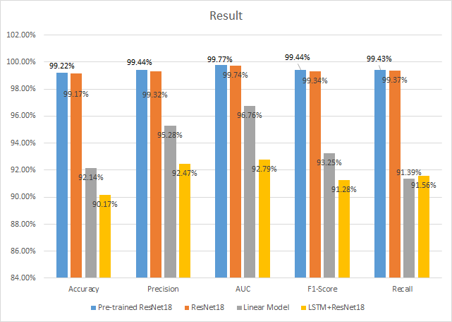
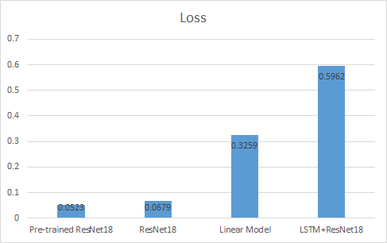

# Report

* Xi Wang, Binghao Yan, Duanmiao Si, Yang Zhang, Zhongyi Wang

## 摘要


## 背景


## 整体逻辑框架


## 方法


### 模型架构

#### Linear Model

```python
class LNet(nn.Module):
    def __init__(self):
        super(LNet, self).__init__()
        self.prenet = nn.Sequential(
            nn.Flatten(),
            nn.Linear(224 * 224 * 3, 1000),
            nn.ReLU(),
            nn.Dropout(0.25),
            nn.Linear(1000, 1000),
            nn.ReLU(),
            nn.Linear(1000, 1000)
        )

        self.predict_net = nn.Sequential(
            nn.Linear(1000, 512),
            nn.BatchNorm1d(512),
            nn.LeakyReLU(),
            nn.Dropout(0.25),
            nn.Linear(512, 128),
            nn.BatchNorm1d(128),
            nn.LeakyReLU(),
            nn.Linear(128, 128),
            nn.LeakyReLU(),
            nn.Linear(128, 2)
        )

    def forward(self, x):
        x = self.prenet(x)
        return torch.sigmoid(self.predict_net(x))
```


#### ResNet18

```python
class MResNet(nn.Module):
    def __init__(self, dtype='Res18', pretrain=True):
        super(MResNet, self).__init__()
        if dtype == 'Res34':
            self.prenet = models.resnet34(pretrained=pretrain)
        else:
            self.prenet = models.resnet18(pretrained=pretrain)

        self.predict_net = nn.Sequential(
            nn.Linear(1000, 512),
            nn.BatchNorm1d(512),
            nn.LeakyReLU(),
            nn.Dropout(0.25),
            nn.Linear(512, 128),
            nn.BatchNorm1d(128),
            nn.LeakyReLU(),
            nn.Linear(128, 128),
            nn.LeakyReLU(),
            nn.Linear(128, 2)
        )

    def forward(self, x):
        x = self.prenet(x)
        return torch.sigmoid(self.predict_net(x))
```


#### LSTM+ResNet18

```python
class LSTMNet(nn.Module):
    def __init__(self):
        super(LSTMNet, self).__init__()
        self.LSTM_encoder = nn.LSTM(num_layers=1, hidden_size=12, input_size=3)
        self.prenet1 = nn.Sequential(
            nn.Conv2d(in_channels=12, out_channels=3, kernel_size=3, padding=1),
            nn.ELU(),
        )
        self.prenet2 = models.resnet18(pretrained=True)

        self.predict_net = nn.Sequential(
            nn.Linear(1000, 512),
            nn.BatchNorm1d(512),
            nn.LeakyReLU(),
            nn.Dropout(0.25),
            nn.Linear(512, 128),
            nn.BatchNorm1d(128),
            nn.LeakyReLU(),
            nn.Linear(128, 128),
            nn.LeakyReLU(),
            nn.Linear(128, 2)
        )

    def forward(self, x):
        x = x.view([-1, 3, 224*224])
        x = x.permute(2, 0, 1)
        x, (cn, hn) = self.LSTM_encoder(x)
        x = x.permute(1, 2, 0)
        x = x.reshape([-1, 12, 224, 224])
        x = self.prenet1(x)
        x = x.reshape([-1, 3, 224, 224])
        x = self.prenet2(x)
        return torch.sigmoid(self.predict_net(x))
```


### Distributed Training

Multiprocessing with `DistributedDataParallel` duplicates the model across multiple GPUs, each of which is controlled by one process. (A process is an instance of python running on the computer; by having multiple processes running in parallel, we can take advantage of processors with multiple CPU cores. If you want, you can have each process control multiple GPUs, but that should be obviously slower than having one GPU per process. It’s also possible to have multiple worker processes that fetch data for each GPU, but I’m going to leave that out for the sake of simplicity.) The GPUs can all be on the same node or spread across multiple nodes. (A node is one “computer,” including all of its CPUs and GPUs. If you’re using AWS, a node is one EC2 instance.) Every process does identical tasks, and each process communicates with all the others. Only gradients are passed between the processes/GPUs so that network communication is less of a bottleneck.


During training, each process loads its own minibatches from disk and passes them to its GPU. Each GPU does its own forward pass, and then the gradients are all-reduced across the GPUs. Gradients for each layer do not depend on previous layers, so the gradient all-reduce is calculated concurrently with the backwards pass to further alleviate the networking bottleneck. At the end of the backwards pass, every node has the averaged gradients, ensuring that the model weights stay synchronized.

### Mixed Precision Boosting

There are numerous benefits to using numerical formats with lower precision than 32-bit floating point. First, they require less memory, enabling the training and deployment of larger neural networks. Second, they require less memory bandwidth which speeds up data transfer operations. Third, math operations run much faster in reduced precision, especially on GPUs with Tensor Core support for that precision. Mixed precision training achieves all these benefits while ensuring that *no* task-specific accuracy is lost compared to full precision training. It does so by identifying the steps that require full precision and using 32-bit floating point for only those steps while using 16-bit floating point everywhere else.


## 结果

### ResNet18

#### Train Set


#### Val Set


### Linear Model

#### Train Set


#### Val Set


### LSTM+ResNet18

#### Train Set


#### Val Set


### Performance in Test Set

Models’ training parameters

|                        |    Models     | Optimizer | Learning Rate (LR) | Total Number of Parameters |
| :--------------------- | :-----------: | :-------: | :----------------: | :------------------------: |
| Pre-trained models     |   ResNet18    |    SGD    |       0.0001       |         75,022,273         |
| Non-pre-trained models |   ResNet18    |    SGD    |       0.0001       |         74,032,491         |
| Pre-trained models     |   ResNet18    |   Adam    |       0.0001       |         75,022,273         |
| Non-pre-trained models |   ResNet18    |   Adam    |       0.0001       |         74,032,491         |
| Non-pre-trained models | Linear Model  |    SGD    |      0.00002       |         37,374,032         |
| Non-pre-trained models | Linear Model  |   Adam    |      0.00003       |         37,374,032         |
| Non-pre-trained models | LSTM+ResNet18 |    SGD    |      0.00005       |         33,795,841         |
| Non-pre-trained models | LSTM+ResNet18 |   Adam    |      0.00006       |         33,795,841         |

SGD = Stochastic gradient descent


The performance validation of the proposed models.

|                        |    Models     |  Loss  | Accuracy | Precision |  AUC   | F1-Score | Recall |
| :--------------------- | :-----------: | :----: | :------: | :-------: | :----: | :------: | :----: |
| Pre-trained models     |   ResNet18    | 0.0523 |  99.22%  |  99.44%   | 99.77% |  99.44%  | 99.43% |
| Non-pre-trained models |   ResNet18    | 0.0679 |  99.17%  |  99.32%   | 99.74% |  99.34%  | 99.37% |
| Non-pre-trained models | Linear Model  | 0.3259 |  92.14%  |  95.28%   | 96.76% |  93.25%  | 91.39% |
| Non-pre-trained models | LSTM+ResNet18 | 0.5962 |  90.17%  |  92.47%   | 92.79% |  91.28%  | 91.56% |







## 结论


## 讨论

* **Model interpretability**

​	Although our model has high accuracy, it leaves room for improvement in terms of interpretability. Interpretability is necessary because, in practice, the models we train are not suitable for all occasions. We only train based on the data obtained in this project, and our model may fail when it encounters new data later. Overly complex data often leads to poor model interpretability. This also makes us know the architecture of the model, but we are still unclear about the specific training process. Considering the interpretability of the model, we try to keep the model as simple as possible, such as the linear model we trained, and we did not use a deep network when using ResNet, and we chose ResNet18 (17 volumes). build layer + 1 fully connected layer). Of course, there is still a lack of model interpretability. If there is a chance in the future, methods such as Grad CAM can be used to solve the interpretability problem.


* **Image Identification** 

​	What our project currently does is a classification problem, but we can actually extend it to a recognition problem. What we envision is that we can finally achieve from multi-classification (can also be regarded as a single-label multi-classification problem), detection (also can be regarded as multi-label multi-class logistic regression), semantic segmentation, and border regression to the final picture. The effect of identifying its lesion area. Of course, such a problem is too complicated for us to complete at present, so our next step is to use YOLOv5 to achieve target detection first. YOLOv5 does not use window sliding, but directly divides the original image into small squares that do not overlap each other, and then finally produces a feature map of this size through convolution. In addition, YOLOv5 has the function of adaptive anchor box, so that the size and position of the anchor box does not need to be adjusted according to different training data, so it is easier for us to expand the classification problem studied in our project to a recognition problem.


* **Multi-GPU distributed + mixed precision training**

​	Our main innovation in this project is multi-GPU distributed and mixed precision training. For large-scale model training, a single-card GPU is not enough, and multiple GPUs of the server need to be borrowed. Distributed computing refers to a way of writing programs that utilizes multiple connected different components in a network. Therefore, we use GPU distributed training to build a model that exceeds the memory capacity of a single card, and can increase the Batch Size of the training data to make our training model converge faster and better. Usually when we train the neural network model, the data type used by default is single precision. In order to speed up the training time and reduce the memory occupied during network training, we decided to use the mixed precision training method. And although we use this method to compress the size of the model, it has little effect on the final result, which means that a model with the same effect can be trained with less memory and time. Through the final results, we can also find that the model obtained using multi-GPU distributed and mixed precision training is satisfactory.


